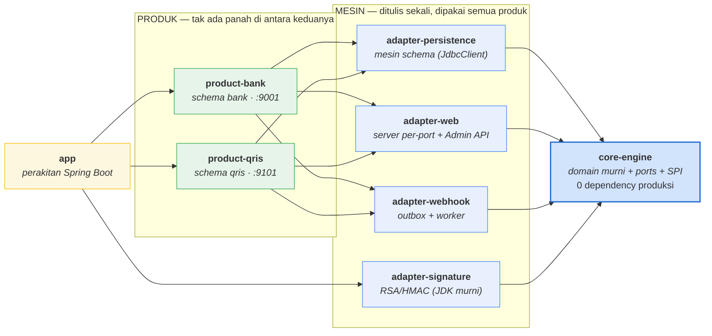
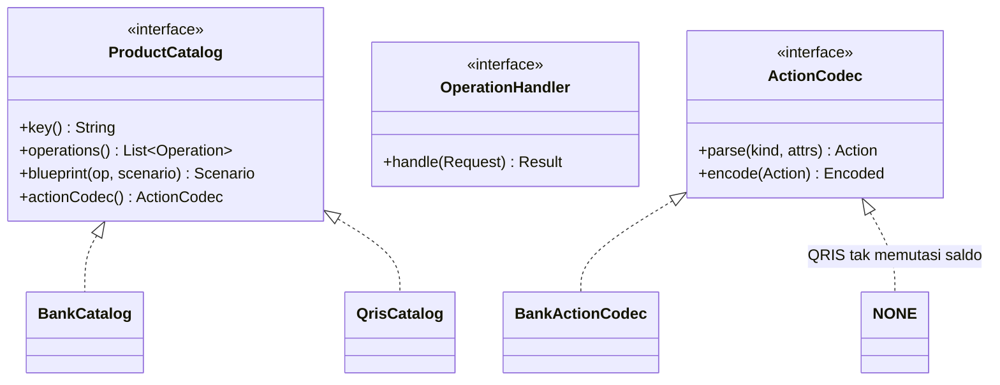
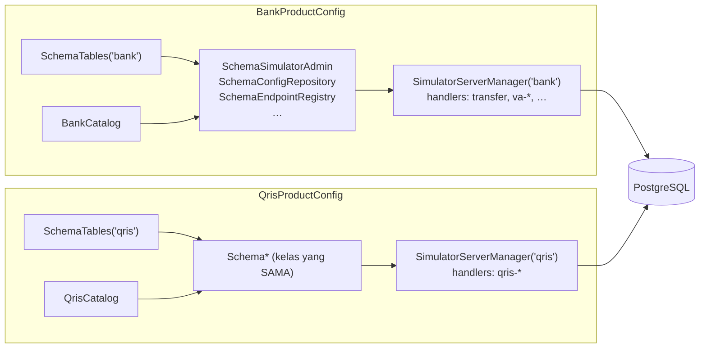
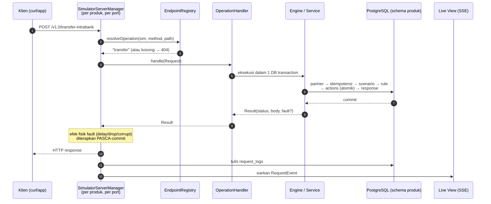
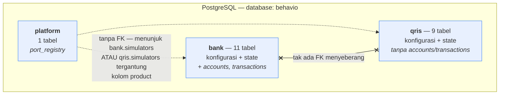
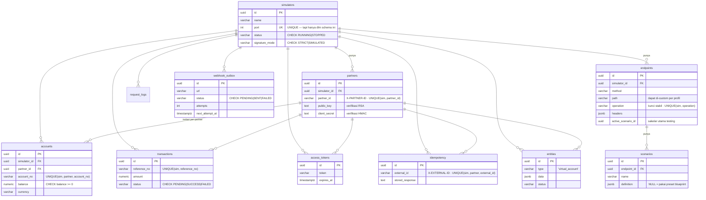
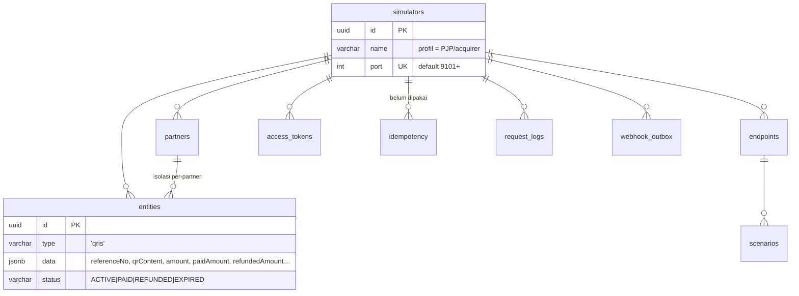
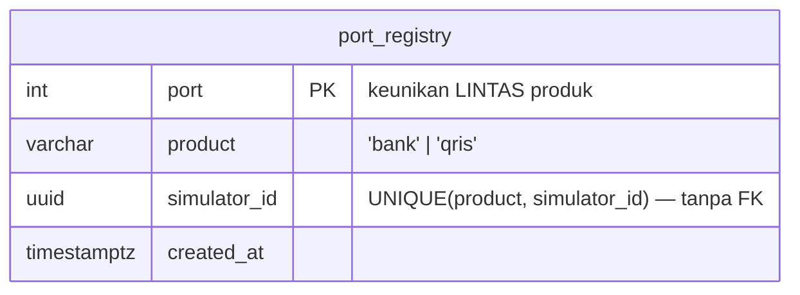

# Arsitektur & Desain Database — Behavio

> Status: **cerminan kode per 2026-07-14** · Diverifikasi langsung dari struktur DB yang
> berjalan (`information_schema`) dan dari classpath Gradle, bukan dari ingatan.
>
> **Hubungan dengan `design.md`:** `design.md` adalah *catatan keputusan* — **kenapa**
> sesuatu dipilih, lengkap dengan alternatif yang ditolak. Dokumen ini *peta struktur* —
> **seperti apa bentuknya sekarang**. Kalau keduanya berbeda, kode yang benar; laporkan
> agar dokumen diperbaiki.

---

## 1. Gambaran singkat

Behavio = simulator API transaksi finansial (SNAP BI + QRIS), self-hosted, diatur lewat
dashboard. Satu aplikasi Spring Boot melayani **beberapa produk** yang terpisah penuh.

Dua sumbu yang penting dibedakan sejak awal:

| Sumbu | Isi | Contoh |
|---|---|---|
| **Produk** | apa yang disimulasikan (domain + schema DB + port sendiri) | `bank`, `qris` |
| **Mesin** | bagaimana simulator bekerja (rule, scenario, server, Admin API) | dipakai bersama semua produk |

Prinsip yang memegang seluruh desain: **pisahkan produk, jangan fork mesin.**
Mesin ditulis **sekali**, di-instansiasi **sekali per produk**. Menambah produk baru =
satu modul + satu `ProductCatalog`; mesin tidak disentuh.

---

## 2. Desain Aplikasi

### 2.1 Peta modul (Gradle)



> Panah = arah dependensi. **Tak ada panah antara `product-bank` dan `product-qris`** —
> itu bukan kelalaian gambar, itu inti desainnya, dan Gradle yang menegakkannya
> (`gradlew :product-qris:dependencies` tidak memuat `:product-bank`).
> Semua panah bermuara ke `core-engine`, dan `core-engine` tak menunjuk siapa pun.

### 2.2 Aturan dependensi (ditegakkan compiler, bukan konvensi)

1. **`core-engine` bebas framework.** `build.gradle.kts`-nya punya **nol** dependency
   produksi. `import org.springframework…` di engine bukan "dilarang" — ia *mustahil*.
2. **Produk tak saling melihat.** Classpath `:product-qris` tidak memuat `:product-bank`
   (dibuktikan `gradlew :product-qris:dependencies`). Import silang = build merah.
3. **`adapter-persistence` sengaja TANPA JPA.** `@Table(schema=…)` itu statis, jadi JPA
   akan memaksa entity diduplikasi per-schema dan mesinnya ikut jadi dua salinan. Mesin
   konfigurasi memakai `JdbcClient` dengan schema sebagai **parameter**. JPA hanya dipakai
   di `product-bank` untuk state uang.
4. Adapter bergantung pada port yang didefinisikan core — bukan sebaliknya.

### 2.3 SPI produk — satu-satunya tempat mesin "tahu" soal produk



Menggantikan tiga peta terpisah sebelum pemisahan (`SnapOperations`, `Blueprints`,
`ProductEndpoints`) yang masing-masing mencampur bank & QRIS dan harus dijaga sinkron.

### 2.4 Perakitan runtime

Tiap produk merakit mesin generik dengan schema, katalog, dan handler-nya sendiri:



> **Kenapa bean dirakit eksplisit, bukan autowire by-type:** tipe seperti
> `ConfigRepository` kini ada **dua** di aplikasi (satu per produk). Autowire by-type
> tidak tahu mana yang dimaksud, dan salah pilih berarti profil bank membaca schema QRIS
> tanpa error apa pun — hanya datanya yang salah kamar.

### 2.5 Alur satu request simulasi



Catatan penting: **emisi event ada di satu jalur** (server manager) untuk semua operasi.
Sebelumnya hanya transfer yang emit dari dalam engine — di dalam transaksi bisnis —
sehingga request yang rollback tak pernah muncul di Live View, justru saat paling ingin
dilihat.

### 2.6 Admin API

Semua endpoint bersegmen produk; controller-nya **satu set** untuk semua produk
(`{product}` → `ProductRegistry`).

```
/api/admin/v1/{bank|qris}/simulators              GET, POST
                         /{id}                    GET, DELETE
                         /{id}/clone              POST
                         /{id}/start | /stop      POST
                         /{id}/partners           CRUD          (generik)
                         /{id}/endpoints          CRUD path     (generik)
                         /{id}/scenarios?operation=…            (generik)
                         /{id}/scenarios/{name}/definition      (editor)
                         /{id}/active-scenario    PUT
                         /{id}/logs/stream        SSE
                         /{id}/webhooks/outbox    monitoring

khusus produk:
/api/admin/v1/bank/simulators/{id}/accounts            /virtual-accounts
/api/admin/v1/qris/simulators/{id}/qris
/api/admin/v1/webhook-sink                             (test sink, lintas produk)
```

Operasi salah kamar (mis. `?operation=qris-generate` di bawah `/bank/`) ditolak **400**.
Produk tak dikenal → **404**.

---

## 3. Desain Database

### 3.1 Peta schema



`bank` dan `qris` **tidak punya satu pun FK yang saling menyeberang**. Struktur tabel
konfigurasinya identik — itu memang disengaja, karena mesinnya sama dan hanya schema-nya
yang jadi parameter.

### 3.2 Schema `bank`



### 3.3 Schema `qris`

Identik dengan `bank` untuk seluruh tabel konfigurasi, **kecuali**:

- **tidak ada `accounts` & `transactions`** — QRIS MPM di simulator ini tidak memindahkan
  saldo rekening;
- `entities.type` berisi `'qris'` (QR MPM), bukan `'virtual_account'`.



### 3.4 `platform.port_registry` — satu-satunya tabel bersama



**Kenapa ada:** satu proses OS = satu ruang port, tapi `bank.simulators.port` dan
`qris.simulators.port` masing-masing UNIQUE **tanpa saling melihat**. Tanpa registry ini,
profil bank & QRIS bisa sama-sama mengklaim 9001 dan baru gagal saat bind — error yang
muncul jauh dari sebabnya.

**Tanpa FK** karena barisnya menunjuk `bank.simulators` **atau** `qris.simulators`
tergantung kolom `product`. Konsekuensinya baris yatim tak ikut terhapus CASCADE →
dibersihkan `ResetStatusOnBoot` saat aplikasi start.

**Klaim port memakai `INSERT … ON CONFLICT (port) DO NOTHING`**, bukan menangkap
`DuplicateKeyException`: unique violation membuat transaksi Postgres masuk status
*aborted*, sehingga query untuk menyusun pesan error justru gagal `25P02` dan 409 berubah
jadi 500. Ini bug nyata yang pernah terjadi — jangan diubah tanpa memahami ini.

### 3.5 Strategi penyimpanan — hybrid

| Jenis | Bentuk | Alasan |
|---|---|---|
| Pembawa uang (`accounts`, `transactions`) | tabel kaku + CHECK | Ini uang. `balance >= 0` dijaga DB, bukan kode. |
| Non-uang (VA, QR) | `entities` JSONB | Fleksibel, tak perlu migrasi tiap nambah field. |
| Definisi scenario | `scenarios.definition` JSONB | Di-edit dari dashboard, bentuknya cermin AST. |

> **Konvensi wajib:** kolom `jsonb` **tidak pernah dipetakan di entity JPA**.
> `columnDefinition="jsonb"` hanya memengaruhi DDL, bukan binding JDBC — Hibernate tetap
> bind varchar dan setiap update gagal `42804`. Semua akses jsonb lewat JdbcClient dengan
> cast eksplisit (`?::jsonb` / `kolom::text`).

### 3.6 Jejak isolasi per-partner

Setiap baris state membawa `(simulator_id, partner_id)`. Dua partner di simulator yang
sama punya dunia rekening & transaksi yang tak tercampur.

---

## 4. Menambah produk baru

Inilah ujian sesungguhnya dari desain ini. Untuk produk baru (mis. `iso8583`):

1. Buat schema-nya di Liquibase (`db/changelog/<produk>/001-*.sql`).
2. Modul `:product-<nama>` + kelas `ProductCatalog` (daftar operasi + preset blueprint).
3. `<Nama>ProductConfig` merakit mesin generik dengan `SchemaTables("<nama>")`.
4. Daftarkan handler tiap operasi.

**Mesin tidak disentuh sama sekali.** Admin API `/api/admin/v1/<nama>/…` otomatis ada,
karena controller-nya generik.

---

## 5. Keterbatasan yang diketahui (jujur, per 2026-07-14)

Bagian ini sengaja ada supaya dokumen ini tidak jadi brosur.

**`qris.idempotency` belum dipakai.** Dibuat demi simetri; operasi QRIS belum menghormati
`X-EXTERNAL-ID`.

**Isolasi produk belum lengkap di runtime.** Modul sudah tak bisa saling melihat saat
kompilasi, tapi:
- keduanya berbagi **satu Spring context** — satu `@Primary` yang salah bisa membuat bank
  membaca schema QRIS tanpa error;
- keduanya berbagi **satu user DB** (`behavio`) yang punya USAGE di kedua schema — kode
  QRIS *bisa* `SELECT * FROM bank.accounts`; yang mencegah hanya tak ada yang menulis
  begitu. Schema memisahkan *namespace*, bukan *hak akses*.

**SPI masih ber-cetakan HTTP.** `Operation` punya `method` + `defaultPath`;
`OperationHandler.Request` punya `method/path/headers/body`; `Result` punya `status`
(HTTP); server-nya `com.sun.net.httpserver.HttpServer`. Rencana ISO-8583 (design.md §2A
"gRPC/ISO-8583 nanti = tambah adapter inbound") **belum dapat ditepati** tanpa mengangkat
abstraksi transport dulu — ISO-8583 tak punya path/header/HTTP status, melainkan MTI,
bitmap, dan field bernomor di atas TCP. Perlu diputuskan lebih dulu: ISO-8583 itu
**produk baru** atau **transport lain untuk produk bank yang sudah ada** (ATM/POS
menyentuh rekening yang sama).

**Dua klaim pola di design.md §2A tak cocok dengan kode**: *Chain of Responsibility* —
`DefaultBehaviorEngine.process()` sebenarnya method lurus dengan early-return, bukan
rantai objek handler; *State* — `QrisTransaction` itu enum + guard, bukan objek state
polimorfik.

---

## 6. Pipeline Scenario Engine & Handler Wiring

### 6.1 Dua jalur eksekusi

Operasi bank dijalankan lewat salah satu dari dua jalur:

| Jalur | Endpoint | Mekanisme |
|---|---|---|
| **Engine penuh** | transfer, transfer-interbank, balance-inquiry, account-inquiry-internal, transaction-history-list | `SimulationExecutor` → `DefaultBehaviorEngine.process()` — auth, scenario, rule, actions, response rendering |
| **Handler + wrapper** | access-token, va-create, va-status, va-delete | Handler khusus + `withScenario()` — handler jalan seperti biasa, wrapper cek scenario untuk Bank Down / Timeout |

### 6.2 Engine penuh (`DefaultBehaviorEngine.process`)

Pipeline lengkap (urutan persis sesuai kode):
1. Partner resolution (`X-PARTNER-ID`)
2. STRICT mode: validasi Bearer token + HMAC-SHA512 transactional signature
3. Idempotensi (`X-EXTERNAL-ID`) — balas respons tersimpan bila ada
4. Scenario lookup dari `ConfigRepository.findActiveScenario(sim, method, path)`
5. Rule evaluation (first-match dari `scenario.rules()`)
6. Aplikasi actions (Debit/Credit/CreateTransaction) — read-only endpoint punya actions kosong
7. Render response dari template `ResponseSpec.bodyTemplate`
8. Simpan untuk idempotensi
9. Webhook scheduling (bila ada `WebhookSpec`)
10. Fault effects (delay/drop/corrupt — diterapkan adapter pasca-commit)

### 6.3 Handler wrapping (`withScenario`)

Semua operasi non-engine dipasangi wrapper `withScenario()` di `BankProductConfig`:

```
request masuk
  → ConfigRepository.findActiveScenario(sim, method, path)
  → jika scenario.name == "Bank Down" → balas 503 {"responseCode":"5030000",...}
  → panggil handler asli
  → jika scenario.name == "Timeout" → bungkus hasil dengan FaultSpec.delayAfter(5000)
  → kembalikan hasil ke adapter
```

**Catatan:** `access-token` tidak bisa masuk engine karena flow auth-nya berbeda — ia pakai `X-CLIENT-KEY` + RSA asymmetric signature, bukan `X-PARTNER-ID` + HMAC-SHA512.

### 6.4 Custom response definition

| Endpoint | Custom definition dipakai runtime? | Mekanisme |
|---|---|---|
| transfer | **Ya** — engine render dari `scenarios.definition` | `ResponseRenderer.render(template, vars)` |
| transfer-interbank | **Ya** | Sama |
| balance-inquiry | **Ya** | Sama + `enrichAccountVars()` tambah `holderName` dari DB |
| account-inquiry-internal | **Ya** | Sama |
| transaction-history-list | **Ya** | Sama |
| access-token | **Tidak** — hanya nama scenario (Bank Down/Timeout) | `withScenario()` wrapper |
| va-create | **Tidak** — sama | `withScenario()` wrapper |
| va-status | **Tidak** — sama | `withScenario()` wrapper |
| va-delete | **Tidak** — sama | `withScenario()` wrapper |

### 6.5 Blueprint default per endpoint

Setiap endpoint punya blueprint Java yang mendefinisikan 3 scenario standar:

| Blueprint Class | Scenario | Template variables |
|---|---|---|
| `TransferIntrabankBlueprint` | Normal, Saldo Kurang, Limit, Bank Down, Timeout, Commit Then Drop, Malformed, Async Callback | `{{sourceAccountNo}}`, `{{amount}}`, `{{amountValue}}`, `{{currency}}`, ... |
| `InterbankTransferBlueprint` | Normal, Saldo Kurang, Limit, Bank Down, Timeout | Sama + `{{beneficiaryBankCode}}`, `{{traceNo}}` |
| `BalanceInquiryBlueprint` | Normal, Bank Down, Timeout | `{{accountNo}}`, `{{holderName}}`, `{{amountValue}}`, `{{currency}}` |
| `AccountInquiryInternalBlueprint` | Normal, Bank Down, Timeout | `{{accountNo}}`, `{{holderName}}`, `{{currency}}` |
| `TransactionHistoryListBlueprint` | Normal, Bank Down, Timeout | `{{amountValue}}`, `{{currency}}`, `{{txnStatus}}`, `{{txnType}}` |
| `AccessTokenBlueprint` | Normal, Bank Down, Timeout | `{{accessToken}}`, `{{expiresIn}}` |
| `VirtualAccountCreateBlueprint` | Normal, Bank Down, Timeout | `{{virtualAccountNo}}`, `{{virtualAccountName}}`, `{{amountValue}}` |
| `VirtualAccountStatusBlueprint` | Normal, Bank Down, Timeout | `{{virtualAccountNo}}`, `{{vaStatus}}` |
| `VirtualAccountDeleteBlueprint` | Normal, Bank Down, Timeout | — (response sederhana) |

Blueprint disimpan di kode Java (`BankCatalog.blueprint()`), **bukan di database**.
Database (`scenarios.definition`) hanya menyimpan **override custom** dari user.
Alur resolusi: `definition` tidak NULL/blank → pakai isinya; NULL → pakai blueprint Java.

### 6.6 SnapRequestMapper (generic field extraction)

`SnapRequestMapper.toFields()` mengekstrak **semua** field JSON body secara rekursif ke
flat `Map<String, Object>`. Special handling:

- `amount: { value, currency }` → `amount` (BigDecimal) + `currency` (String) — backward compat
- `totalAmount: { value, currency }` → `totalAmount.value` + `totalAmount.currency`
- Nested objects diekstrak dengan dot notation (`nested.field`)
- Numbers dikonversi ke `BigDecimal`

Field-flat ini jadi input ke `EvalContext` (evaluasi rule) dan `renderResponse` (substitusi
template variable).
